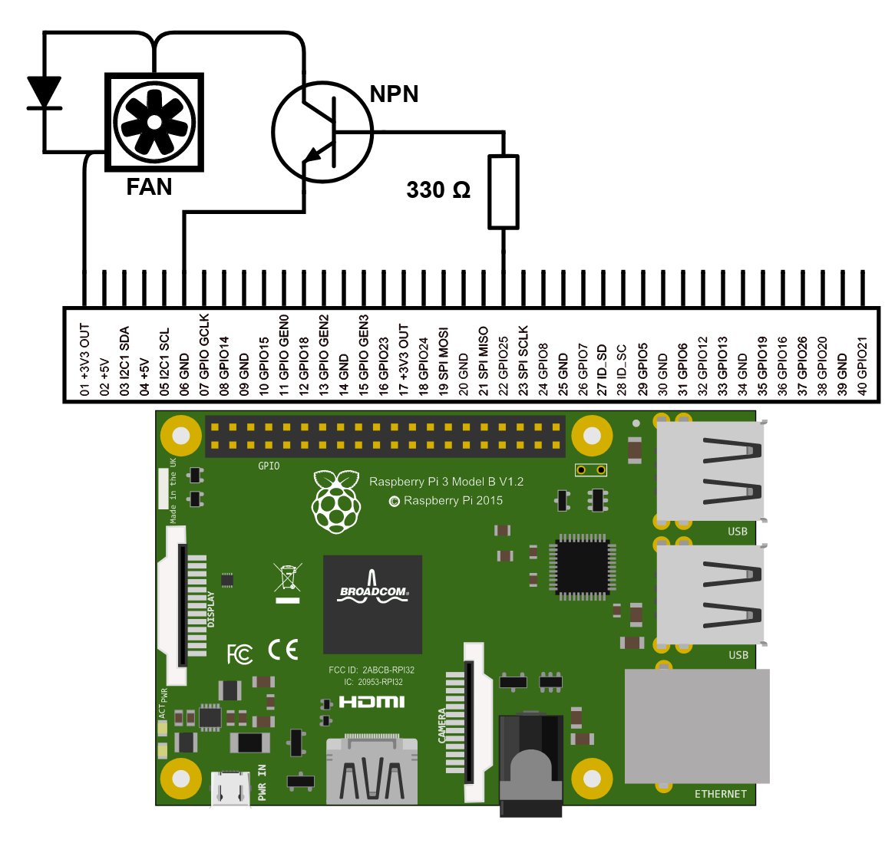

# RPiFanControl

Simple script to turn on a fan (controlled by GPIO Pin 25) on a Raspberry Pi. The fan will turn on once the temperature reaches 65°C. Every 5 minutes the script checks the temperature again and turn the fan off if the temperature dropped below the threshold.

In my use case the fan is used to prevent overheating and throttling of a Raspberry Pi 3 Model B running a LibreELEC mediacenter.
The addon and script is using python instead of python3 because of missing python3 support in LibreELEC 9.

## Kodi Addon

To build the Kodi Addon .zip file use the `build-addon-zip.sh` script.
The script executed in the addon is `addon.py`.

## Testing

If you want to test the script on the command line you can use `main.py`. Make sure to install the Raspberry Pi Tools Addon to have access to the GPIO library.

## Electronic Circuit

The value of the base resistor will depend on your transistor characteristics, the ampere usage of your fan and if you run it on 3.3V or 5V.

